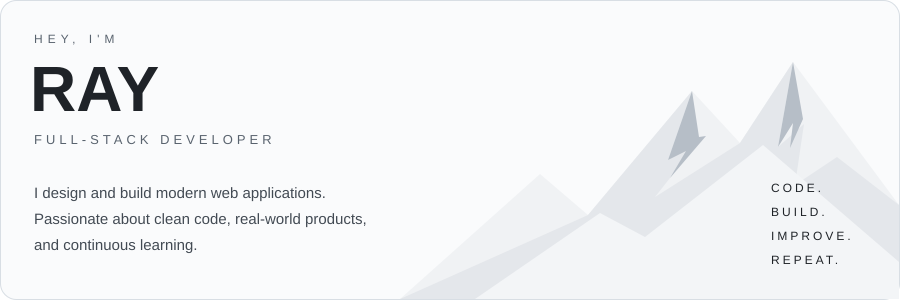
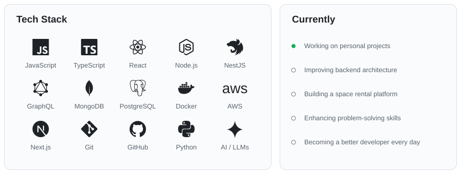

<picture>
  <source media="(prefers-color-scheme: dark) and (max-width: 600px)" srcset="assets/header-mobile-dark.svg">
  <source media="(prefers-color-scheme: light) and (max-width: 600px)" srcset="assets/header-mobile-light.svg">
  <source media="(prefers-color-scheme: dark)" srcset="assets/header-dark.svg">
  <source media="(prefers-color-scheme: light)" srcset="assets/header-light.svg">
  
</picture>

<!-- snake:start -->
<picture>
  <source media="(prefers-color-scheme: dark)" srcset="https://raw.githubusercontent.com/firdavsyangiev/firdavsyangiev/output/github-contribution-grid-snake-dark.svg">
  <source media="(prefers-color-scheme: light)" srcset="https://raw.githubusercontent.com/firdavsyangiev/firdavsyangiev/output/github-contribution-grid-snake.svg">
  
</picture>
<!-- snake:end -->

<picture>
  <source media="(prefers-color-scheme: dark) and (max-width: 600px)" srcset="assets/overview-mobile-dark.svg">
  <source media="(prefers-color-scheme: light) and (max-width: 600px)" srcset="assets/overview-mobile-light.svg">
  <source media="(prefers-color-scheme: dark)" srcset="assets/overview-dark.svg">
  <source media="(prefers-color-scheme: light)" srcset="assets/overview-light.svg">
  
</picture>

### Connect

[GitHub ↗](https://github.com/firdavsyangiev) &nbsp; / &nbsp; LinkedIn: www.linkedin.com/in/firdavsyangiev &nbsp; / &nbsp; Instagram: https://www.instagram.com/firdavs_yangiev/ &nbsp; / &nbsp; Email: firdavsyangiev@gmail.com &nbsp; / &nbsp; Portfolio: `PORTFOLIO_SOON)`

---

Built with ☕ and a lot of late nights. Stay curious. Keep building.
