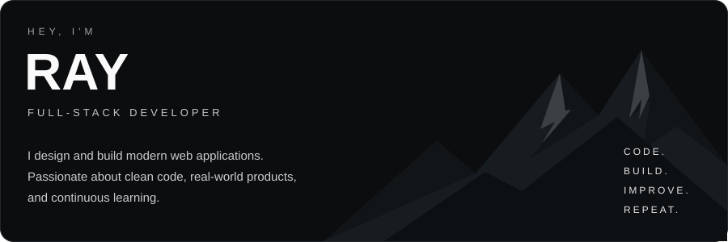
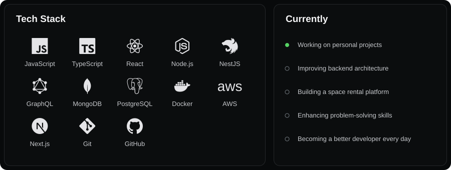

<picture>
  <source media="(max-width: 600px)" srcset="assets/header-mobile.svg">
  
</picture>

<!-- snake:start -->
<picture>
  <source media="(prefers-color-scheme: dark)" srcset="https://raw.githubusercontent.com/firdavsyangiev/firdavsyangiev/output/github-snake-dark.svg">
  <source media="(prefers-color-scheme: light)" srcset="https://raw.githubusercontent.com/firdavsyangiev/firdavsyangiev/output/github-snake.svg">
  
</picture>
<!-- snake:end -->

<picture>
  <source media="(max-width: 600px)" srcset="assets/overview-mobile.svg">
  
</picture>

### Featured projects

<!-- projects:start -->
#### space-rental-platform

Discover and rent unique spaces for any occasion.

`Next.js` · `TypeScript` · `MongoDB`

Repository link pending — no public repository with this name found.

#### real-estate-platform

A modern real estate platform with advanced search and filters.

`React` · `Node.js` · `GraphQL`

Repository link pending — no public repository with this name found.

#### portfolio

My personal developer portfolio.

`Next.js` · `TypeScript` · `Tailwind CSS`

Repository link pending — no public repository with this name found.
<!-- projects:end -->

[View all repositories →](https://github.com/firdavsyangiev?tab=repositories)

### Connect

[GitHub ↗](https://github.com/firdavsyangiev) &nbsp; / &nbsp; LinkedIn: `YOUR_LINKEDIN_URL` &nbsp; / &nbsp; Instagram: `YOUR_INSTAGRAM_URL` &nbsp; / &nbsp; Email: `YOUR_EMAIL` &nbsp; / &nbsp; Portfolio: `YOUR_PORTFOLIO_URL`

---

Built with ☕ and a lot of late nights. Stay curious. Keep building.
